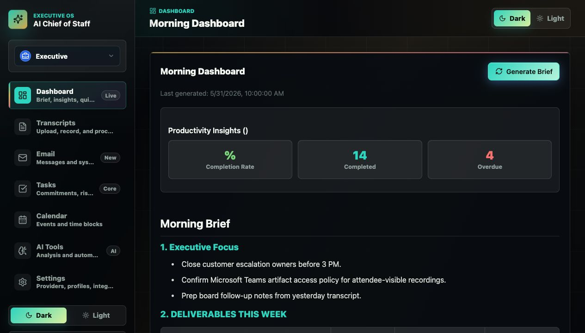
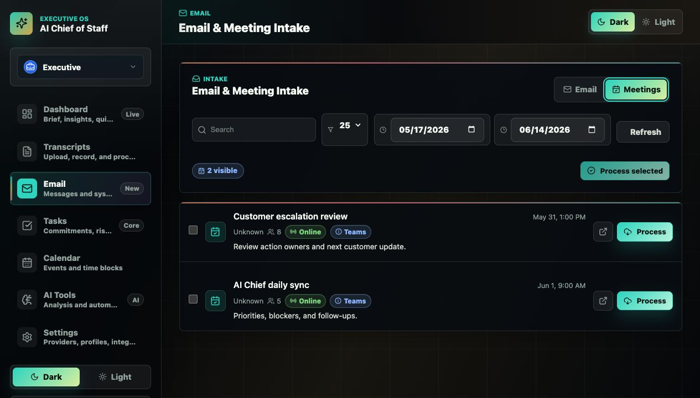
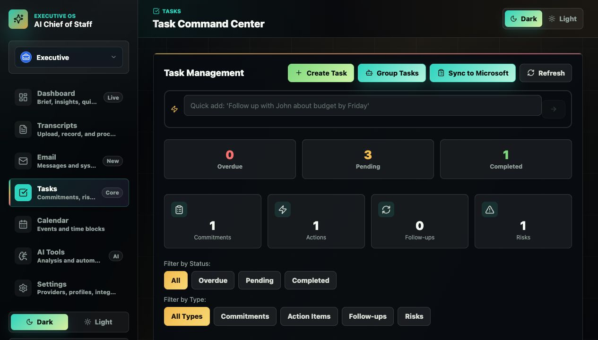
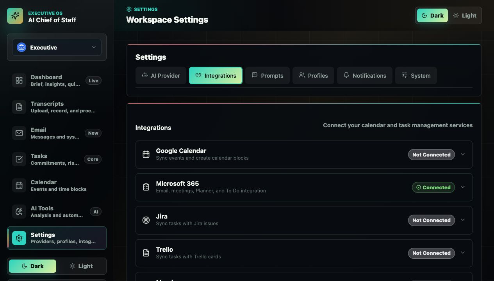

# AI Chief of Staff

AI Chief of Staff is a self-hosted executive operating system for turning
meetings, Teams artifacts, email, recordings, and notes into tasks, briefs,
context, and daily priorities.

The application is designed to run privately, connect to Microsoft 365 and task
systems, and keep sensitive operational data under your control.

## Product Overview

AI Chief of Staff helps an operator, manager, founder, or executive turn the
daily stream of meetings, messages, notes, and follow-ups into an organized
work system. It is not just a transcript uploader or a task list. It combines:

- Intake from meetings, email, Teams artifacts, manual notes, recordings, and
  uploaded files.
- AI review that extracts only relevant commitments, action items, follow-ups,
  and risks.
- A task command center for confirming, editing, prioritizing, completing,
  ignoring, bulk-managing, and syncing work.
- Daily briefs and productivity insights that summarize active work and surface
  what needs attention.
- Integrations with Microsoft 365, Google Calendar, Jira, Microsoft Planner,
  Microsoft To Do, Trello, Monday.com, and CalDAV-style calendars.
- Profile-specific configuration for different work contexts, prompts, AI
  providers, and integration behavior.

The product is intentionally conservative about creating work. It tries to
avoid creating tasks from spam, automated email, ambiguous assignment language,
or commitments that belong to someone else. When new input looks like existing
work, it updates or suppresses duplicates instead of flooding the task list.

## What It Handles

| Area | Capabilities |
| --- | --- |
| Dashboard | Morning brief generation, weekly deliverables view, productivity signals, work stats, connection health, and quick navigation |
| Email Intake | Search Microsoft 365 mailbox messages, filter unread mail, preview messages, and process selected email into task/context records |
| Meeting Intake | Search Microsoft 365 meetings, import single or bulk meetings, detect Teams meetings, and process meeting artifacts |
| Transcripts | Paste notes, upload transcript/audio/video files, record audio in the browser, reprocess records, view generated meeting notes, and track processing progress |
| Tasks | Manage commitments, actions, follow-ups, and risks with confirmation queues, filters, quick add, bulk delete, ignore-similar learning, duplicate prevention, completion notes, and external sync |
| Calendar | View Google or Microsoft calendar events, create manual time blocks, and add selected task deadlines to calendars without auto-flooding availability |
| Integrations | Configure Microsoft 365, Google Calendar, Jira, Microsoft Planner/To Do, Trello, Monday.com, and CalDAV/Radicale/Nextcloud |
| AI Tools | Estimate effort, classify energy, cluster related tasks, parse natural-language tasks, extract commitments, transcribe audio, search context, and analyze work patterns |
| Settings | Configure AI providers, named credentials, profile-specific preferences, prompts, user aliases, notifications, themes, storage, and system health |
| Admin | Cache clearing, version/service visibility, protected history wipe, profile-aware data reset, and production auth controls |

## Core Product Workflows

1. Capture the signal.
   Import Microsoft email, Microsoft meetings, Teams transcripts/recordings,
   pasted notes, uploaded transcripts, or recorded audio.

2. Let AI extract and reconcile work.
   The system reviews the content for tasks, risks, commitments, follow-ups,
   owners, deadlines, urgency, and context. It checks against recent active work
   before creating new tasks.

3. Confirm and manage.
   Review tasks that need confirmation, edit details, complete work with notes,
   ignore noisy patterns, filter by type, bulk-delete, or add selected deadlines
   to a calendar.

4. Sync outward when desired.
   Push tasks to Jira, Microsoft To Do, or a selected Microsoft Planner plan and
   bucket. Calendar event creation is opt-in, so task tracking does not
   automatically pollute your schedule.

5. Review the operating picture.
   Generate a daily brief, scan deliverables, review productivity insights, and
   use the Dashboard to jump into the next workflow.

## Feature Details

### Dashboard

- Generates a morning brief from current tasks, context, transcripts, and recent
  activity.
- Parses the weekly deliverables section into a readable table when the brief
  includes structured deliverables.
- Shows productivity insights such as completion rate, completed work, overdue
  work, and most productive day when enough history exists.
- Shows counts for context items, commitments, and transcripts.
- Provides quick actions for Tasks, Transcripts, Calendar, and Settings.
- Displays connectivity status so configured services are visible without
  cluttering the header with unused integrations.

### Email And Meeting Intake

- Connects to Microsoft 365 for mailbox and calendar-based intake.
- Searches and filters email by query, unread status, and result limit.
- Previews sender, subject, importance, unread state, body preview, and links
  back to Microsoft 365.
- Processes individual emails into the same task extraction pipeline used for
  meetings and transcripts.
- Searches meetings by date range, query, and limit.
- Detects online/Teams meetings, attendee count, organizer, and meeting links.
- Supports single-meeting processing and bulk meeting import.
- Captures Teams transcripts and recordings when Microsoft Graph permissions,
  tenant policy, and artifact availability allow it.
- Keeps pending Teams artifacts in a retryable state when recordings or
  transcripts are not available yet.

### Transcripts, Notes, And Recordings

- Uploads supported transcript, audio, and video files.
- Pastes manual meeting notes with filename, source, and meeting date metadata.
- Records audio in the browser and sends it through the transcription pipeline.
- Tracks live processing state, progress percentage, pending retries, failures,
  and completed transcripts.
- Reprocesses existing transcripts after prompt or provider changes.
- Generates and displays meeting notes from processed transcripts.
- Syncs recent Microsoft email and Teams meetings into the transcript/history
  pipeline.

### Task Management

- Tracks four work types: commitments, action items, follow-ups, and risks.
- Separates tasks needing confirmation from active work.
- Filters by type and supports select-all, bulk delete, and individual delete.
- Adds manual tasks with task type, assignee, deadline, and priority.
- Provides a natural-language quick add bar for fast task creation.
- Marks tasks complete with optional completion notes.
- Adds selected non-risk tasks with deadlines to connected calendars.
- Syncs tasks to Jira and to Microsoft task targets when enabled.
- Retries failed Jira syncs.
- Removes or closes synced external records where possible when local tasks are
  deleted or completed.
- Records "Ignore Similar" patterns so future matching tasks or emails can be
  suppressed.
- Supports "do not ask again" confirmation preferences for repetitive task
  actions.
- Uses AI task clustering to show related work and reduce duplicate noise.

### AI Task Learning

- Creates commitments and action items only when the configured user appears to
  be responsible for the work.
- Skips work assigned to other people or with ambiguous ownership.
- Allows follow-ups when the configured user needs to check, unblock, request,
  or verify someone else's work.
- Skips risks from automated email when the signal is likely spam or system
  noise.
- Looks for similar active tasks across threads and content sources before
  creating new work.
- Updates existing tasks with new deadlines, priority, descriptions, and system
  notes when later emails or meetings refine the same work.
- Learns from ignored/deleted/rejected items and configurable prompt guidance.

### Calendar

- Connects to Google Calendar and Microsoft Calendar.
- Lists upcoming events from the connected provider.
- Creates manual calendar blocks from the app.
- Adds task deadlines to the calendar only when the user chooses to do so, or
  when profile-specific auto-create behavior is explicitly enabled.
- Keeps existing task-linked calendar events aligned when task deadlines change.
- Treats risks as informational records rather than calendar events.

### Integrations

- Microsoft 365: shared OAuth connection for email intake, meeting intake,
  Microsoft Calendar, Teams artifacts, Microsoft To Do, and Microsoft Planner.
- Microsoft task sync: enable/disable task sync, choose Microsoft To Do or
  Microsoft Planner, select a To Do list, choose a Planner plan and bucket, and
  optionally assign Planner tasks to the signed-in Microsoft user.
- Jira: configure site, email, API token, project key, issue creation, update
  notes, retries, and close/delete behavior.
- Google Calendar: configure OAuth credentials, connect/disconnect, and use as a
  calendar event provider.
- Trello: configure API key, token, and board for task-card workflows through
  the integrations service.
- Monday.com: configure API token and board for task-item workflows through the
  integrations service.
- CalDAV/Radicale/Nextcloud: configure server URL, username, password, and
  optional calendar path for self-hosted calendar workflows.

### AI Tools

- Effort estimation with complexity, confidence, reasoning, breakdown, and risk
  notes.
- Energy classification with cognitive load, best-time guidance, and duration
  recommendations.
- Semantic task clustering and recommended grouping.
- Natural-language task parsing with title, deadline, priority, assignee,
  estimated hours, tags, and confidence.
- Quick add parsing for short task snippets.
- Commitment extraction from meeting notes or email text.
- Audio transcription for supported audio/video formats.
- Context retrieval and text search across stored context.
- Pattern recognition for completion rate, overdue work, productive days,
  completion timing, and productivity insights.

### Profiles, Prompts, And Settings

- Multiple profiles for separating work, personal, client, or role-specific
  operating contexts.
- Profile-specific AI provider and model preferences.
- Named AI credentials for Anthropic, OpenAI, and Ollama/local workflows.
- Editable prompts for task extraction and task learning behavior.
- User alias, role, company, and department settings so ownership detection can
  distinguish "my work" from "someone mentioned work".
- Notification settings and browser push notification support.
- Theme selection, service health, version details, storage configuration, and
  microservice health checks.
- Protected history wipe that can reset all profiles or only the current
  profile while preserving configuration.

### Deployment And Operations

- Self-hosted Docker Compose stack for the frontend, backend, database, cache,
  and microservices.
- PostgreSQL support for production data storage.
- Redis-backed cache and coordination.
- Internal service TLS support for backend-to-microservice traffic.
- Reverse-proxy-friendly configuration for SWAG, Nginx Proxy Manager, Traefik,
  or similar setups.
- API token protection for browser access and destructive admin operations.
- Environment-driven OAuth, database, CORS, proxy, and service discovery
  settings.

## Interface Preview

The screenshots below use generic demo data.









## Critical Security Requirement

Set `AICOS_AUTH_TOKEN` or `API_TOKEN` before exposing the app or using
destructive admin tools.

The admin history wipe feature in `Settings > System > Danger Zone` will not run
unless one of those tokens is configured. This is intentional. The wipe tool
permanently removes stored transcripts, imported email/meeting records, tasks,
briefs, context, insights, and notification history while preserving profiles,
prompts, provider settings, and integrations.

Generate strong secrets:

```bash
openssl rand -base64 48   # API and OAuth secrets
openssl rand -hex 32      # PostgreSQL password
```

For public deployments, keep `VITE_API_TOKEN` blank. Users enter the backend API
token through the app prompt instead of shipping a shared token inside frontend
assets.

## Architecture

```text
Browser
  |
  v
React PWA frontend                 :3000
  |
  v
Node/Express backend API           :3001
  |
  +-- PostgreSQL                   primary database
  +-- Redis                        cache and coordination
  +-- AI Intelligence              task analysis
  +-- Pattern Recognition          productivity insights
  +-- NL Parser                    task parsing
  +-- Voice Processor              audio transcription
  +-- Context Service              fast context retrieval
  +-- Integrations Service         external workflow integrations
```

Most product behavior is configured in the app UI. Environment files should
hold deployment, security, database, service discovery, and OAuth callback
fallbacks.

## Repository Layout

| Path | Purpose |
| --- | --- |
| [frontend/](frontend/) | React 19 PWA and responsive app shell |
| [backend/](backend/) | Express API, security middleware, database access, OAuth flows |
| [services/](services/) | AI, parser, context, voice, and integration microservices |
| [docs/](docs/) | Production, Microsoft 365, architecture, and styling docs |
| [unraid/](unraid/) | Unraid templates and deployment notes |
| [swag-config/](swag-config/) | SWAG reverse proxy example |
| [docker-compose.yml](docker-compose.yml) | Main Docker Compose stack |
| [env.example](env.example) | Environment template |

## Quick Start

Prerequisites:

- Docker and Docker Compose
- Git
- A strong API token
- A strong PostgreSQL password

```bash
git clone https://github.com/JoshuaSeidel/ai-chief-of-staff.git
cd ai-chief-of-staff

cp env.example .env
```

Edit `.env` before starting:

```env
AICOS_AUTH_TOKEN=replace-with-a-long-random-token
OAUTH_STATE_SECRET=replace-with-a-long-random-oauth-state-secret
POSTGRES_PASSWORD=replace-with-a-secure-postgres-password
FRONTEND_URL=http://localhost:3000
ALLOWED_ORIGINS=http://localhost:3000,http://localhost:3001
TRUST_PROXY=false
```

Start the stack:

```bash
docker compose up --build -d
docker compose logs -f aicos-backend
```

Open:

```text
http://localhost:3000
```

The frontend will prompt for the API token when the backend returns `401`.

## First-Run Setup

1. Open the app and enter the API token.
2. Go to `Settings`.
3. Select or create a profile.
4. Configure an AI provider.
5. Configure Microsoft 365, Google Calendar, Jira, or Planner if needed.
6. Open `Settings > Prompts > Task Learning` and confirm the user's aliases,
   role, company, and task extraction instructions.
7. Confirm the header shows only connectivity pills for configured services.
8. Import a transcript, email, or meeting and review extracted tasks.

## Docker Compose Notes

The compose stack now reads deployment values from `.env` and no longer hardcodes
weak database credentials.

Fresh installs generate the backend `config.json` from `DB_TYPE`,
`DATABASE_URL`, or `POSTGRES_*` values. Existing installs keep their saved
database configuration until changed in Settings.

Important variables:

| Variable | Required | Notes |
| --- | --- | --- |
| `AICOS_AUTH_TOKEN` or `API_TOKEN` | Yes | API auth and destructive admin tool gate |
| `POSTGRES_PASSWORD` | Yes | Used by PostgreSQL and all services |
| `FRONTEND_URL` | Production | Public browser origin |
| `ALLOWED_ORIGINS` | Production | Comma-separated browser origins allowed to write to the API |
| `TRUST_PROXY` | Reverse proxy | Set `true` behind SWAG, Nginx Proxy Manager, Traefik, etc. |
| `VITE_API_URL` | Usually `/api` | Build-time frontend API URL |
| `ALLOW_INSECURE_TLS` | Local only | Defaults to `false`. Set `true` ONLY for local dev when you cannot mount the shared service CA — disables backend->microservice cert verification |

The `tls-certs` named volume is created automatically and shared by the backend
and microservices for internal HTTPS certificates.

Useful commands:

```bash
docker compose config
docker compose ps
docker compose logs -f
docker compose pull
docker compose up --build -d
```

## Production Checklist

Before exposing the system outside a trusted LAN:

- Replace every placeholder secret in `.env`.
- Set `AICOS_AUTH_TOKEN` or `API_TOKEN`.
- Leave `VITE_API_TOKEN` blank unless this is a private controlled build.
- Set `FRONTEND_URL=https://your.domain`.
- Set `ALLOWED_ORIGINS=https://your.domain`.
- Set `TRUST_PROXY=true` behind a trusted reverse proxy.
- Use HTTPS only.
- Back up PostgreSQL and persistent volumes.
- Review Microsoft Graph application permissions before enabling Teams artifact capture.
- Test transcript deletion and the admin history summary after deployment.

See [docs/PRODUCTION-SETUP.md](docs/PRODUCTION-SETUP.md) for the full guide.

## Microsoft 365

Microsoft 365 powers:

- Email intake
- Meeting list import
- Microsoft Calendar
- Planner/To Do
- Teams transcript and recording capture

Production setup requires a Microsoft Entra app registration. Teams transcript
and recording capture also require Graph application permissions plus a Teams
application access policy assigned to the Microsoft 365 user who connects AI
Chief of Staff.

Teams artifact capture resolves recordings and transcripts through the connected
Microsoft user, not through each meeting organizer. That allows capture for
meetings organized by other people only when the connected user is on the
meeting invite and Microsoft Graph still exposes the non-expired Teams artifacts
for that user.

Read [docs/MICROSOFT-365-SETUP.md](docs/MICROSOFT-365-SETUP.md).

## Task Learning And Updates

AI Chief of Staff treats new work signals as updates to existing tasks before it
creates anything new. Meeting transcripts, Teams artifacts, imported emails, and
manual transcript uploads are reviewed against recent active work so duplicate
or near-duplicate commitments are skipped or merged into an existing task.

The task creation gate is intentionally conservative:

- Commitments and action items are created only when the configured user is
  clearly responsible for the work.
- Work assigned to another person or an ambiguous owner is skipped.
- Follow-ups may be created when the configured user should check, unblock,
  request, or verify someone else's work because it matters to their role.
- Existing tasks can receive updated deadlines, severity/priority, descriptions,
  and system notes from later meetings or emails.
- Update notes are pushed into connected task systems such as Jira and Microsoft
  To Do where possible.
- User deletes and rejections are recorded as learning events and can refine the
  editable extraction instructions.

Configure this in:

```text
Settings > Prompts > Task Learning
```

Editable fields include user aliases, job title, company, department, and the
task extraction instructions that guide future AI review.

## Calendar Task Events

Generated tasks no longer create calendar events by default. This avoids
polluting availability with task placeholders when the real tracking system is
Jira, Microsoft To Do, or another task manager.

Calendar behavior is profile-specific:

- `Auto-create calendar events` is off by default.
- Tasks with deadlines show an `Add to Calendar` button in the task card.
- Existing calendar-linked tasks are kept in sync when their deadline changes.
- Risks remain informational and are not added to calendars.

To opt back into automatic calendar events:

```text
Settings > Prompts > Task Learning > Auto-create calendar events
```

## Admin History Wipe

Use `Settings > System > Danger Zone > Wipe History` when you need to start
fresh, such as after changing jobs.

The wipe can target:

- All profiles
- Current profile only

It deletes history tables and derived records, including transcripts, imported
emails/meetings, tasks, briefs, context, insights, project/task associations,
and notification history.

It preserves:

- Profiles
- Prompts
- AI provider settings
- Microsoft 365 tokens/configuration
- Google/Jira/Planner integration settings
- VAPID and OAuth configuration

The UI requires typing `WIPE HISTORY`, and the backend requires
`AICOS_AUTH_TOKEN` or `API_TOKEN` to be configured.

## Local Development

Backend:

```bash
cd backend
npm install
CONFIG_DIR=./data PORT=3001 npm start
```

Frontend:

```bash
cd frontend
npm install
npm run dev -- --host 0.0.0.0 --port 3000
```

Checks:

```bash
cd frontend
npm run lint
npm run build

cd ../backend
node -c server.js
npm audit --audit-level=high
```

## Troubleshooting

### The app asks for an API token

Enter the value of `AICOS_AUTH_TOKEN` or `API_TOKEN`. This is expected when API
auth is enabled.

### Admin wipe says a token is required

Set `AICOS_AUTH_TOKEN` or `API_TOKEN`, restart the backend, and try again.

### DELETE requests return 403

Check `FRONTEND_URL`, `ALLOWED_ORIGINS`, and reverse-proxy headers. Same-host
browser writes are allowed, but cross-origin writes must match the allowlist.

### Frontend cannot reach the backend

For Docker Compose, `VITE_API_URL=/api` should be built into the frontend image
and nginx proxies `/api` to the backend. Rebuild the frontend after changing
Vite build-time variables:

```bash
docker compose build aicos-frontend
docker compose up -d aicos-frontend
```

### Microsoft email or meetings do not load

Reconnect Microsoft after changing Graph scopes. Confirm the redirect URI in
Microsoft Entra exactly matches the app setting or env fallback.

## Documentation

| Document | Purpose |
| --- | --- |
| [docs/PRODUCTION-SETUP.md](docs/PRODUCTION-SETUP.md) | Production and reverse proxy deployment |
| [docs/MICROSOFT-365-SETUP.md](docs/MICROSOFT-365-SETUP.md) | Microsoft Entra, Graph permissions, Teams policy |
| [docs/MICROSERVICES-INTEGRATION.md](docs/MICROSERVICES-INTEGRATION.md) | Service architecture and integration behavior |
| [docs/ARCHITECTURE_FLOWS.md](docs/ARCHITECTURE_FLOWS.md) | Data-flow diagrams and architecture notes |
| [swag-config/README.md](swag-config/README.md) | SWAG reverse proxy setup |
| [unraid/README.md](unraid/README.md) | Unraid deployment notes |

## License

This project is distributed under the custom AI Chief of Staff Software License.
See [LICENSE](LICENSE) for the full terms.
